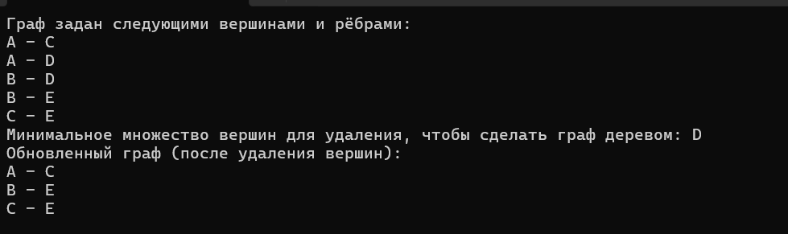
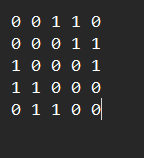

# Расчетная работа

## Цели и задачи
1.Составить алгоритм для нахождения минимального множества вершин неориентированного графа, удаление которых позволяет сделать его деревом.
2.Реализовать данный алгоритм на языке программирования C++.
3.Составить отчет и перенести его на удаленный репозиторий.
## Основные понятия

### Граф
**Граф** — это математическая структура, состоящая из множества вершин (или узлов) и множества рёбер (или связей), которые соединяют пары вершин.
#### Основные понятие графа:
**Вершины**: Элементы графа, которые могут представлять объекты, события, точки и т.д.

**Ребра**: Связи между вершинами, которые показывают, как объекты связаны между собой.

**Неориентированный граф**: Ребра не имеют направления.

**Ориентированный граф**: Ребра имеют направление.

#### Пример неориентированного графа

В этом графе:
- Вершины: A, B, C, D
- Рёбра: (A-B), (A-C), (B-C), (B-D), (C-D)

### Дерево

**Дерево** — это связный ацикличный граф. Это означает, что в дереве:

**Связанность**: Существует путь между любой парой вершин.

**Ацикличность**: В графе нет циклов.

### Матрица смежности

**Матрица смежности** графа — это квадратная матрица, где строка и столбец соответствуют вершинам графа, а значения указывают на наличие ребра между вершинами.

#### Пример:

|     | **А** | **B** | **C** |
|-----|----|----|----|
| **A** |  0 |  1 |  1 |
| **B** |  1 |  0 |  1 |
| **C** |  1 |  1 |  0 |

Что соответствует неориентированному графу с ребрами:

- A - B
- B - C
- C - A

## Алгоритм

### Цель алгоритма - найти циклы в графе и удалить минимальное количество вершин чтобы граф стал деревом.

Используется алгоритм поиска в глубину (**DFS**) для поиска циклов:

- В процессе DFS, если найден соседний узел, который уже посещен, и это не родительский узел, значит, обнаружен цикл.

- Вершины, участвующие в цикле, сохраняются в множество cycles. Этот шаг не находит все циклы, а только те, которые приводят к возникновению первого цикла (жадный подход).

Для удаления минимального количества вершин, которые сделают граф деревом, используется жадный алгоритм:

- Из множества найденных циклов выбирается одна вершина для удаления. Это делается путем вставки первой вершины из множества циклов в итоговое множество вершин для удаления.

После нахождения вершин для удаления, они удаляются из графа. Для каждой вершины, которая должна быть удалена, исключаются все рёбра, которые её касаются, и она не включается в новый граф.

## Пример работы программы

### 1. Чтение матрицы смежности

Сначала программа читает граф из файла в виде матрицы смежности.

```C++

vector<vector<int>> adjMatrix;
string line;
while (getline(inputFile, line)) {
    vector<int> row;
    stringstream ss(line);
    int value;
    while (ss >> value) {
        row.push_back(value);
    }
    adjMatrix.push_back(row);
}
inputFile.close();

```
### 2. Преобразование матрицы смежности в список смежности

После чтения матрицы смежности граф преобразуется в список смежности, где для каждой вершины хранится список её соседей.

```C++
vector<vector<int>> graph(adjMatrix.size());
for (int i = 0; i < adjMatrix.size(); ++i) {
    for (int j = 0; j < adjMatrix.size(); ++j) {
        if (adjMatrix[i][j] != 0) {
            graph[i].push_back(j);
        }
    }
}
```

### 3. Поиск циклов с помощью DFS

```C++
void findCycles(int node, int parent, const vector<vector<int>>& graph, vector<bool>& visited,
    vector<int>& path, unordered_set<int>& cycles) {
    visited[node] = true;
    path.push_back(node);

    for (int neighbor : graph[node]) {
        if (!visited[neighbor]) {
            findCycles(neighbor, node, graph, visited, path, cycles);
        }
        else if (neighbor != parent) {
            // Найден цикл
            cycles.insert(node);
            cycles.insert(neighbor);
        }
    }

    path.pop_back();
}
```

### 4. Поиск вершин для удаления
```C++
unordered_set<int> findVerticesToRemove(const vector<vector<int>>& graph) {
    int n = graph.size();
    vector<bool> visited(n, false);
    unordered_set<int> cycles;

    for (int i = 0; i < n; ++i) {
        if (!visited[i]) {
            vector<int> path;
            findCycles(i, -1, graph, visited, path, cycles);
        }
    }

    unordered_set<int> verticesToRemove;
    if (!cycles.empty()) {
        verticesToRemove.insert(*cycles.begin());
    }

    return verticesToRemove;
}
```

### 5.Удаление вершин из графа
```C++
vector<vector<int>> removeVertices(const vector<vector<int>>& graph, const unordered_set<int>& verticesToRemove) {
    vector<vector<int>> newGraph;
    for (int i = 0; i < graph.size(); ++i) {
        if (verticesToRemove.find(i) == verticesToRemove.end()) {
            vector<int> newRow;
            for (int neighbor : graph[i]) {
                if (verticesToRemove.find(neighbor) == verticesToRemove.end()) {
                    newRow.push_back(neighbor);
                }
            }
            newGraph.push_back(newRow);
        }
    }
    return newGraph;
}
```

### 6.Вывод нового графа
```C++
void printEdges(const vector<vector<int>>& graph) {
    int n = graph.size();
    for (int i = 0; i < n; ++i) {
        for (int j : graph[i]) {
            if (i < j) { 
                cout << char('A' + i) << " - " << char('A' + j) << endl;
            }
        }
    }
}
```
### Пример:


#### Матрица смежности была такой:


## Вывод

### Во время выполнения Расчётной Работы были выполнены все поставленные задачи:

* Были изучены новые термины и понятия,
* Соcтавлен алгоритм по решению теоретико-графовой задачи из 22 варианты
* Алгоритм поиска в глубину (**DFS**)  был перенесён на язык программирования C++
* Был составлен отчет в виде readme-файла на удалённом репозитории


